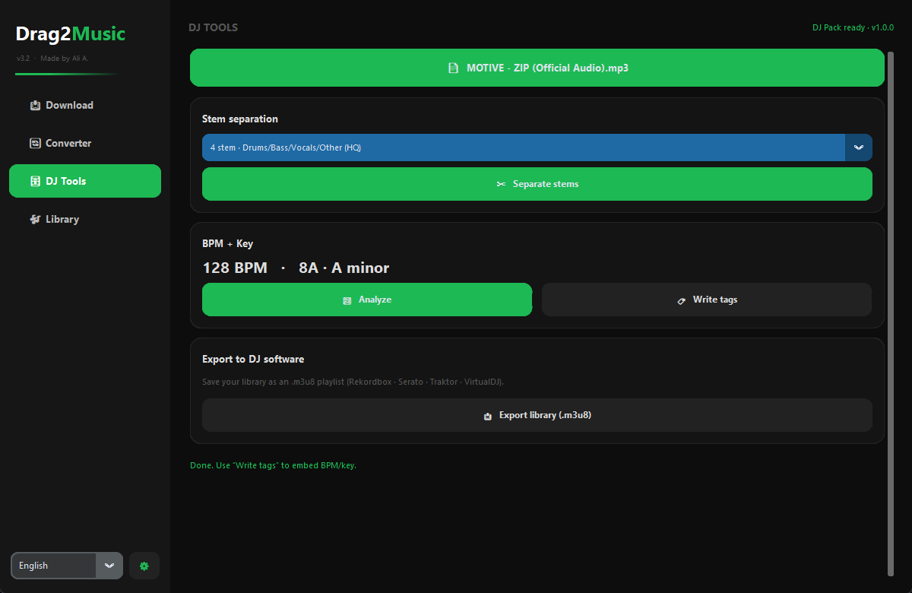

<div align="center">

# 🎵 Drag2Music

**Search · Download · Convert · Lyrics · DJ Tools — a complete music toolkit for your desktop**

[](https://github.com/AliAli2155/Drag2Music/actions/workflows/build.yml)
[](https://github.com/AliAli2155/Drag2Music/releases/latest)
[](LICENSE)
[](https://python.org)
[](#download)

</div>

---

## Screenshots

### 🎚 DJ Tools — new in 3.2



| Download | Library |
|----------|---------|
|  |  |

| Converter | Light theme |
|-----------|-------------|
|  |  |

---

## Download

| Platform | Installer | Notes |
|----------|-----------|-------|
| 🪟 Windows | [Drag2Music_Setup.exe](https://github.com/AliAli2155/Drag2Music/releases/latest/download/Drag2Music_Setup.exe) | One-click installer — no Python required |
| 🍎 macOS | [Drag2Music.dmg](https://github.com/AliAli2155/Drag2Music/releases/latest/download/Drag2Music.dmg) | Drag & drop to Applications |
| 🐧 Linux | [Drag2Music-x86_64.AppImage](https://github.com/AliAli2155/Drag2Music/releases/latest/download/Drag2Music-x86_64.AppImage) | Single file, runs on any distro |
| 🐧 Linux | [drag2music_3.2.0_amd64.deb](https://github.com/AliAli2155/Drag2Music/releases/latest/download/drag2music_3.2.0_amd64.deb) | Debian / Ubuntu package |

> **Fully self-contained** — Python runtime, ffmpeg, and all libraries are bundled inside. Nothing else to install.
>
> The AI-powered **DJ Tools** (stem separation + BPM/key) use an optional [**DJ Pack**](#-dj-tools--the-dj-pack) you download once from inside the app — so the base installer stays small.

---

## What's new in 3.2 — DJ Tools 🎚

A whole new page built for DJs and producers:

- ✂️ **Stem separation** — split any track into **Vocals + Instrumental** (2-stem) or **Drums / Bass / Vocals / Other** (4-stem), engine selectable.
- 🎛️ **BPM + Key analysis** — automatic tempo and musical-key detection with **Camelot** codes for harmonic mixing. Runs on demand, or automatically on every download.
- 🏷️ **Metadata tagging** — writes BPM and key straight into the file so they import cleanly into **Rekordbox · Serato · Traktor · VirtualDJ**.
- 📤 **DJ export** — save your whole library as an **`.m3u8`** playlist any DJ app can read.
- 📦 **Optional DJ Pack** — the heavy AI models live in a separate, downloadable add-on (see below); the core app and installer stay lean.

*Plus everything from 3.1: redesigned sidebar UI, large album-art cover card, richer library, EBU R128 loudness normalization and ~1s startup.*

---

## Features

| | |
|---|---|
| 🔍 **Search & Analyze** | Search YouTube or SoundCloud by URL or keyword — loads title, artist, duration, high-res cover art, and an honest source-quality badge (real codec / bitrate) |
| ⬇️ **Downloader** | Audio (MP3, AAC, OGG, WAV, FLAC, OPUS) or video (MP4, MKV, WEBM, AVI) with per-format quality selection, cover-art embedding, and live speed / progress |
| 📋 **Playlist support** | Paste any YouTube playlist or SoundCloud set → queue every track in one click with a playlist progress bar |
| ✂️ **Stem separation** | Vocals + Instrumental (2-stem) or Drums/Bass/Vocals/Other (4-stem) — *needs the DJ Pack* |
| 🎛️ **BPM + Key** | Automatic tempo + key detection with Camelot codes; on demand or auto on download — *needs the DJ Pack* |
| 🏷️ **DJ tagging & export** | Write BPM/key tags for Rekordbox/Serato/Traktor, and export the library to `.m3u8` |
| 🎚️ **DJ-grade audio** | Optional EBU R128 loudness normalization (−14 / −9 LUFS) with a fixed 44.1 kHz sample rate |
| 📚 **Rich library** | Full download history with format, quality, size, duration, source, BPM/key and timestamp |
| 🔄 **File converter** | Convert local audio/video files to any format using the bundled ffmpeg |
| 📜 **Auto lyrics** | Fetches lyrics automatically from multiple sources (syncedlyrics, lyrist, lyrics.ovh, lrclib) |
| 🎨 **Themes** | 6 accent colors with animated transitions + Dark / Light mode |
| 🌐 **11 languages** | English, Türkçe, Español, Français, Deutsch, Português, Italiano, Русский, Ελληνικά, 日本語, 中文 — switch live, no restart |
| 🔗 **Drag & drop** | Drop a URL straight onto the search bar |

---

## 🎚 DJ Tools & the DJ Pack

Stem separation and BPM/key analysis are powered by **AI models** (PyTorch / ONNX / librosa) that are far too heavy to bundle into every install. So Drag2Music keeps them in an **optional DJ Pack**:

- The base app ships with **no** heavy ML dependencies — startup stays fast and the installer small.
- The first time you open **DJ Tools** (or enable *Auto BPM + key*), a **“Download DJ Pack”** banner appears. One click fetches the right pack for your OS and installs it to `~/.drag2music/dj-pack/`.
- The app then runs the pack as a background helper — just like it already does with ffmpeg.

| Engine | Stems | Backend |
|--------|-------|---------|
| **2-stem** (fast) | Vocals + Instrumental | `audio-separator` (ONNX Runtime) |
| **4-stem** (HQ) | Drums / Bass / Vocals / Other | `Demucs` (PyTorch, CPU) |

> **No pack needed for:** metadata tagging (BPM/key → file) and `.m3u8` export — those run in the base app.
> **Heads-up:** separation runs on CPU, so a full track can take a few minutes. The pack is a one-time download (a few hundred MB).

The DJ Pack is published as its own release (tag `djpack-v*`) so it can be updated independently of the app. See [`docs/DJ_FEATURES.md`](docs/DJ_FEATURES.md) and [`dj_pack/README.md`](dj_pack/README.md) for the architecture and build details.

---

## Running from Source

### Requirements

- Python 3.11+
- ffmpeg in PATH **or** placed in `ffmpeg_bins/<platform>/` (auto-detected)

### Install & Run

```bash
git clone https://github.com/AliAli2155/Drag2Music.git
cd Drag2Music
pip install -r requirements.txt
python main.py
```

> The base requirements **do not** include the ML stack. To use stem separation / BPM-key from a source checkout, either let the app download the DJ Pack, or install the worker deps into a separate environment — see [`dj_pack/README.md`](dj_pack/README.md).

### Python Dependencies

| Package | Purpose |
|---------|---------|
| `customtkinter` | Modern UI framework |
| `yt-dlp` | YouTube / SoundCloud downloading & info extraction |
| `mutagen` | Cover-art embedding + DJ tag writing (BPM / key) |
| `Pillow` | Cover rendering, gradients, image processing |
| `plyer` | Desktop notifications |
| `requests` | HTTP (thumbnails, lyrics APIs, DJ Pack download) |
| `syncedlyrics` | Synced lyrics fetching |
| `tkinterdnd2` | Drag & drop support |
| `pyinstaller` | Packaging (build only) |

### ffmpeg

**Windows** — place `ffmpeg.exe` in `ffmpeg_bins/windows/` (or project root), or download from [gyan.dev](https://www.gyan.dev/ffmpeg/builds/)

**macOS** — `brew install ffmpeg`

**Linux** — `sudo apt install ffmpeg`

---

## Project Structure

```
Drag2Music/
├── main.py                    Boot, ffmpeg path injection, app __init__, window icon
├── core/
│   ├── ui_setup.py            Layout, sidebar, gradient widgets, canvas library list
│   ├── analyzer.py            Video analysis, playlists, cover + caption rendering, drag-drop
│   ├── downloader.py          Download queue, progress hooks, yt-dlp options, auto-analyze hook
│   ├── settings.py            Settings popup, themes, languages, persistence
│   ├── converter.py           Local file conversion (ffmpeg)
│   ├── lyrics.py              Auto lyrics (syncedlyrics + 3 fallback APIs)
│   ├── audio_quality.py       Source-quality badge, loudness normalization
│   ├── dj_tools.py            DJ Tools page actions (separate / analyze / tag / export / pack install)
│   ├── dj_pack.py             Optional DJ Pack manager (download + subprocess worker)
│   ├── stems.py               Stem-separation client → worker
│   ├── music_analysis.py      BPM + key client → worker (+ Camelot table)
│   ├── tagger.py              BPM/key/genre tag writer (mutagen)
│   ├── dj_export.py           .m3u8 library export
│   ├── constants.py           Colors, format maps, theme palette, STEM_ENGINES, DJ_PACK_*, APP_VERSION
│   └── translations.py        11-language string table
├── dj_pack/                   Optional DJ Pack worker (heavy ML) — built & released separately
│   ├── worker.py              CLI worker: analyze / separate (librosa · audio-separator · demucs)
│   ├── worker.spec            PyInstaller spec for the worker
│   ├── build_djpack.py        Freeze + warm models + zip the pack
│   └── requirements.txt       Worker-only deps (torch / onnxruntime / librosa …)
├── assets/                    app icon (icon.png → icon.ico / icon.icns)
├── ffmpeg_bins/               Static ffmpeg binaries (downloaded at build time)
├── build_scripts/             Platform build scripts + ffmpeg downloader + setup_assets
├── installer/                 Inno Setup / DMG / AppImage scripts
├── docs/                      Screenshots + DJ_FEATURES.md (DJ Tools architecture)
├── .github/workflows/         build.yml (installers) · build-djpack.yml (DJ Pack)
├── drag2music.spec            PyInstaller spec
└── requirements.txt
```

---

## Building

Two independent release pipelines, both via **GitHub Actions**:

| Push | Workflow | Produces |
|------|----------|----------|
| `v*` tag (e.g. `v3.2.0`) | `build.yml` | Windows `.exe`, macOS `.dmg`, Linux AppImage + `.deb` + GitHub Release |
| `djpack-v*` tag (e.g. `djpack-v1.0.0`) | `build-djpack.yml` | Per-platform DJ Pack zips + GitHub Release |

For local builds see [README_BUILD.md](README_BUILD.md) (app) and [`dj_pack/README.md`](dj_pack/README.md) (DJ Pack).

```bat
# Windows  (needs Inno Setup 6 for the installer)
build_scripts\build_windows.bat

# macOS
chmod +x build_scripts/build_macos.sh && ./build_scripts/build_macos.sh

# Linux
chmod +x build_scripts/build_linux.sh && ./build_scripts/build_linux.sh
```

---

## Troubleshooting

- **“DJ Pack required” / separation or analysis won't run** — open **DJ Tools** and click **Download DJ Pack** (a one-time download). It installs to `~/.drag2music/dj-pack/`.
- **Stem separation is slow** — it runs on the CPU; a full song can take a few minutes. The 2-stem engine is faster than 4-stem.
- **“Cover art skipped” after a download** — install `mutagen` (`pip install mutagen`); it is required for embedding covers into MP4/M4A.
- **Some YouTube formats missing / slow analysis** — yt-dlp may warn about a missing JavaScript runtime; installing [deno](https://deno.land) removes the warning.
- **Drag & drop not working on Linux** — make sure `tkinterdnd2` installed correctly for your distro's Tcl/Tk.

---

## Made by Ali A.

---

*All rights reserved.*
