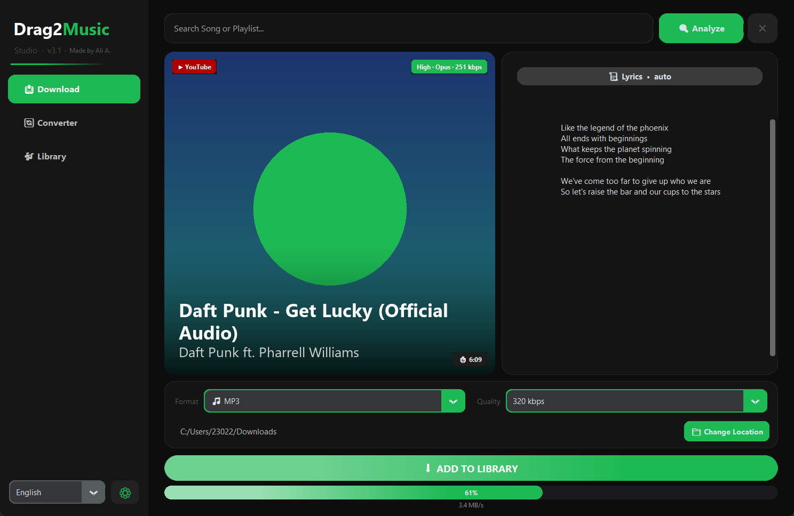
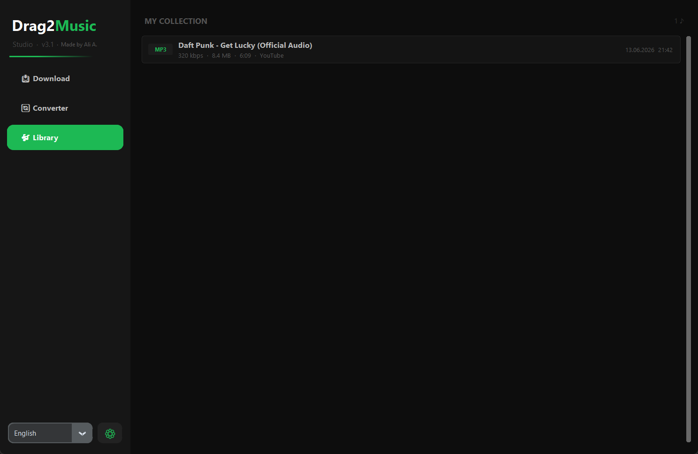
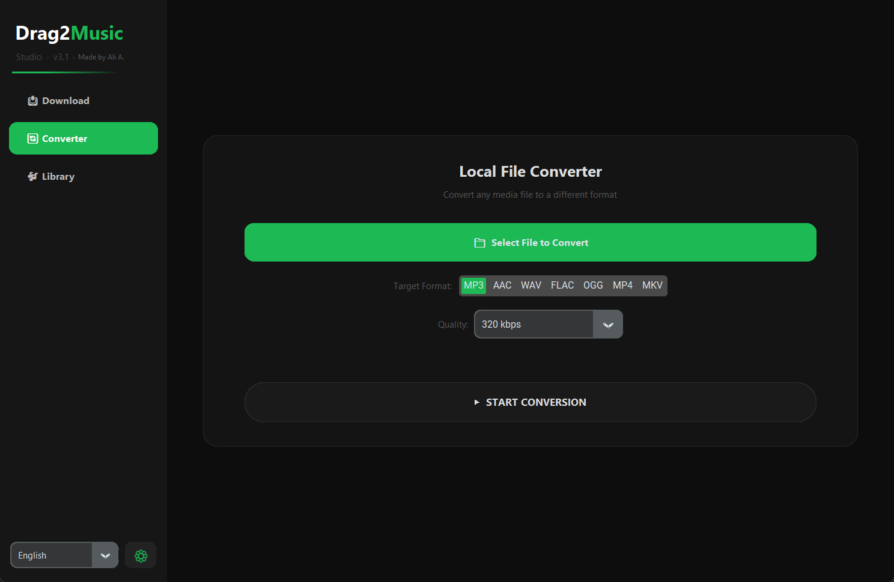
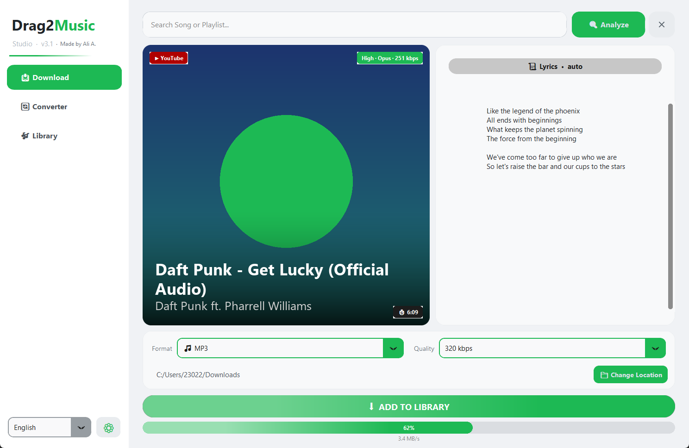

<div align="center">

# 🎵 Drag2Music: Infinity Studio

**Search · Download · Convert · Lyrics — a complete music downloader for your desktop**

[](https://github.com/AliAli2155/Drag2Music/actions/workflows/build.yml)
[](https://github.com/AliAli2155/Drag2Music/releases/latest)
[](LICENSE)
[](https://python.org)
[](#download)

</div>

---

## Screenshots

| Download | Library |
|----------|---------|
|  |  |

| Converter | Light theme |
|-----------|-------------|
|  |  |

---

## Download

| Platform | Installer | Notes |
|----------|-----------|-------|
| 🪟 Windows | [Drag2Music_Setup.exe](https://github.com/AliAli2155/Drag2Music/releases/latest/download/Drag2Music_Setup.exe) | One-click installer — no Python required |
| 🍎 macOS | [Drag2Music.dmg](https://github.com/AliAli2155/Drag2Music/releases/latest/download/Drag2Music.dmg) | Drag & drop to Applications |
| 🐧 Linux | [Drag2Music-x86_64.AppImage](https://github.com/AliAli2155/Drag2Music/releases/latest/download/Drag2Music-x86_64.AppImage) | Single file, runs on any distro |
| 🐧 Linux | [drag2music_3.1.0_amd64.deb](https://github.com/AliAli2155/Drag2Music/releases/latest/download/drag2music_3.1.0_amd64.deb) | Debian / Ubuntu package |

> **Fully self-contained** — Python runtime, ffmpeg, and all libraries are bundled inside. Nothing else to install.

---

## What's new in 3.1

- 🎛️ **Redesigned studio UI** — sidebar navigation, a large album-art cover card, accent gradients and smooth animations.
- 🖼️ **Title & artist on the cover** — baked into the artwork behind a gradient scrim, with perfectly symmetric cover / lyrics cards.
- 🎨 **Theme-aware app icon** — the window icon switches automatically: white mark in Dark mode, black mark in Light mode.
- 🎬 **Reliable MP4 downloads** — cover-art embedding fixed (mutagen) and smarter format selection.
- 📚 **Richer library** — every download records format, quality, file size, duration, source and timestamp; renders instantly even with hundreds of entries.
- ⚡ **Much faster startup** (~1s) and zero jank when resizing or maximizing.

---

## Features

| | |
|---|---|
| 🔍 **Search & Analyze** | Search YouTube or SoundCloud by URL or keyword — loads title, artist, duration, high-res cover art, and an honest source-quality badge (real codec / bitrate) |
| ⬇️ **Downloader** | Audio (MP3, AAC, OGG, WAV, FLAC, OPUS) or video (MP4, MKV, WEBM, AVI) with per-format quality selection, cover-art embedding, and live speed / progress |
| 📋 **Playlist support** | Paste any YouTube playlist or SoundCloud set → queue every track in one click with a playlist progress bar |
| 📚 **Rich library** | Full download history with format, quality, size, duration, source and timestamp |
| 🔄 **File converter** | Convert local audio/video files to any format using the bundled ffmpeg |
| 📜 **Auto lyrics** | Fetches lyrics automatically from multiple sources (syncedlyrics, lyrist, lyrics.ovh, lrclib) |
| 🎚️ **DJ-grade audio** | Optional EBU R128 loudness normalization (−14 / −9 LUFS) with a fixed 44.1 kHz sample rate |
| 🎨 **Themes** | 6 accent colors with animated transitions + Dark / Light mode (theme-aware app icon) |
| 🌐 **11 languages** | English, Türkçe, Español, Français, Deutsch, Português, Italiano, Русский, Ελληνικά, 日本語, 中文 — switch live, no restart |
| 🔗 **Drag & drop** | Drop a URL straight onto the search bar |

---

## Running from Source

### Requirements

- Python 3.11+
- ffmpeg in PATH **or** placed in `ffmpeg_bins/<platform>/` (auto-detected)

### Install & Run

```bash
git clone https://github.com/AliAli2155/Drag2Music.git
cd Drag2Music
pip install -r requirements.txt
python main.py
```

### Python Dependencies

| Package | Purpose |
|---------|---------|
| `customtkinter` | Modern UI framework |
| `yt-dlp` | YouTube / SoundCloud downloading & info extraction |
| `mutagen` | Cover-art embedding for MP4 / M4A / FLAC |
| `Pillow` | Cover rendering, gradients, image processing |
| `plyer` | Desktop notifications |
| `requests` | HTTP (thumbnails, lyrics APIs) |
| `syncedlyrics` | Synced lyrics fetching |
| `tkinterdnd2` | Drag & drop support |
| `pyinstaller` | Packaging (build only) |

### ffmpeg

**Windows** — place `ffmpeg.exe` in `ffmpeg_bins/windows/` (or project root), or download from [gyan.dev](https://www.gyan.dev/ffmpeg/builds/)

**macOS** — `brew install ffmpeg`

**Linux** — `sudo apt install ffmpeg`

---

## Project Structure

```
Drag2Music/
├── main.py                    Boot, ffmpeg path injection, app __init__, themed icon
├── core/
│   ├── ui_setup.py            Layout, sidebar, gradient widgets, canvas library list
│   ├── analyzer.py            Video analysis, playlists, cover + caption rendering, drag-drop
│   ├── downloader.py          Download queue, progress hooks, yt-dlp options
│   ├── settings.py            Settings popup, themes, languages, persistence
│   ├── converter.py           Local file conversion (ffmpeg)
│   ├── lyrics.py              Auto lyrics (syncedlyrics + 3 fallback APIs)
│   ├── audio_quality.py       Source-quality badge, loudness normalization
│   ├── constants.py           Colors, format maps, theme palette, APP_VERSION
│   └── translations.py        11-language string table
├── assets/                    icon-white / icon-black (png/ico/icns) + static defaults
├── ffmpeg_bins/               Static ffmpeg binaries (downloaded at build time)
├── build_scripts/             Platform build scripts + ffmpeg downloader + setup_assets
├── installer/                 Inno Setup / DMG / AppImage scripts
├── docs/screenshots/          README screenshots
├── .github/workflows/         CI: builds all 3 platforms; releases on a v* tag
├── drag2music.spec            PyInstaller spec
└── requirements.txt
```

---

## Building

All three platforms build automatically via **GitHub Actions**. Pushing a `v*` tag (e.g. `v3.1.0`) builds the installers and publishes a GitHub Release. For local builds see [README_BUILD.md](README_BUILD.md).

```bat
# Windows  (needs Inno Setup 6 for the installer)
build_scripts\build_windows.bat

# macOS
chmod +x build_scripts/build_macos.sh && ./build_scripts/build_macos.sh

# Linux
chmod +x build_scripts/build_linux.sh && ./build_scripts/build_linux.sh
```

---

## Troubleshooting

- **"Cover art skipped" after a download** — install `mutagen` (`pip install mutagen`); it is required for embedding covers into MP4/M4A.
- **Some YouTube formats missing / slow analysis** — yt-dlp may warn about a missing JavaScript runtime; installing [deno](https://deno.land) removes the warning.
- **Drag & drop not working on Linux** — make sure `tkinterdnd2` installed correctly for your distro's Tcl/Tk.

---

## Made by Ali A.

---

*All rights reserved.*
